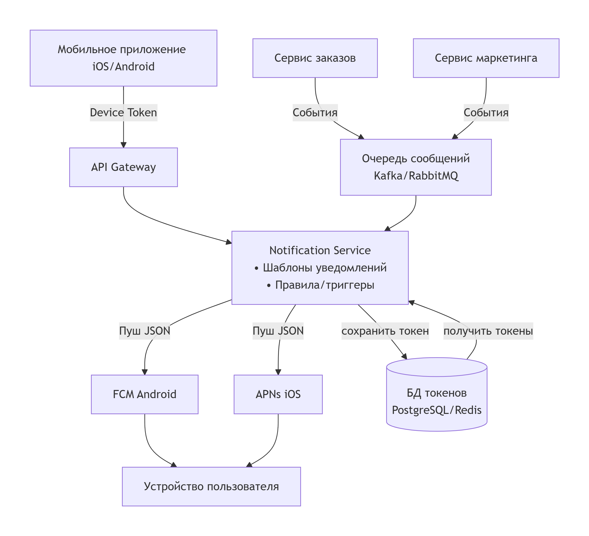

1. Mobile app

   Получает пуши через системный сервис (APNs для iOS, FCM для Android).

   Отправляет токен устройства на бэкенд
2. API Gateway

   Принимает запросы от моб. приложения (например, регистрация токена)

   Маршрутизирует запросы к микросервисам
3. Триггерные микросервисы
   Сервис корзины / заказов

   Сервис маркетинга / промо

   Сервис аналитики / рекомендации
4. Очередь сообщений (примеры: Kafka, RabbitMQ)
5. Выбранная  система доставки
   FCM (Firebase Cloud Messaging) – Android.
   APNs (Apple Push Notification service) – iOS.
   Notification Service отправляет уведомления через эти сервисы.
6. Хранилище (БД)

   Redis или PostgreSQL
   Хранит device token'ы и настройки пользователей
   Notification Service читает токены отсюда перед отправкой

